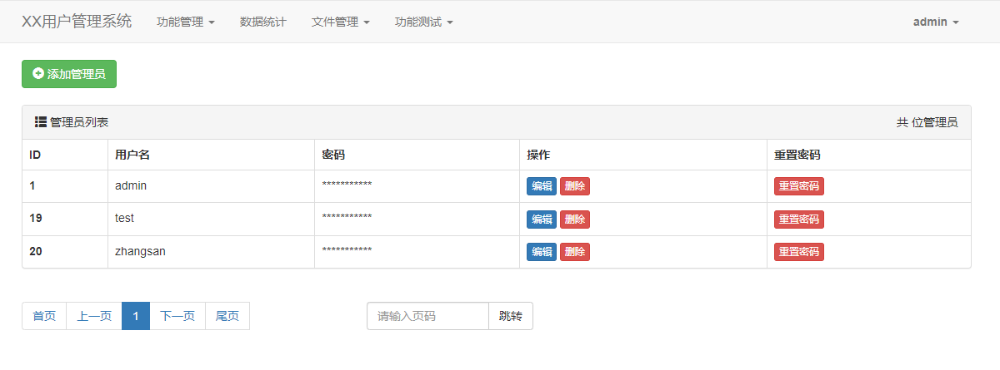
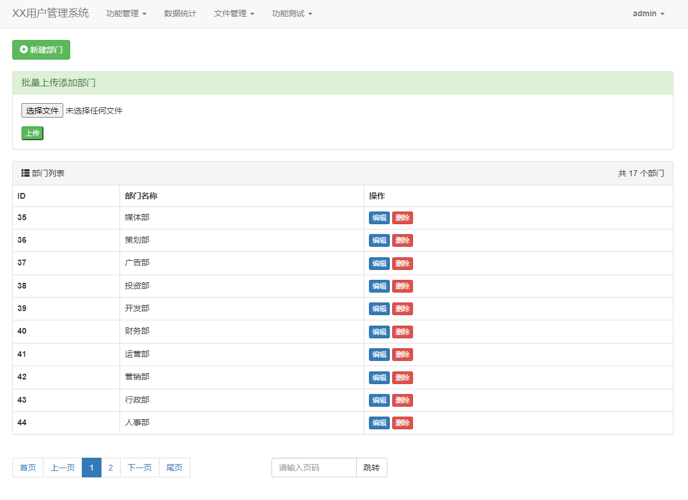
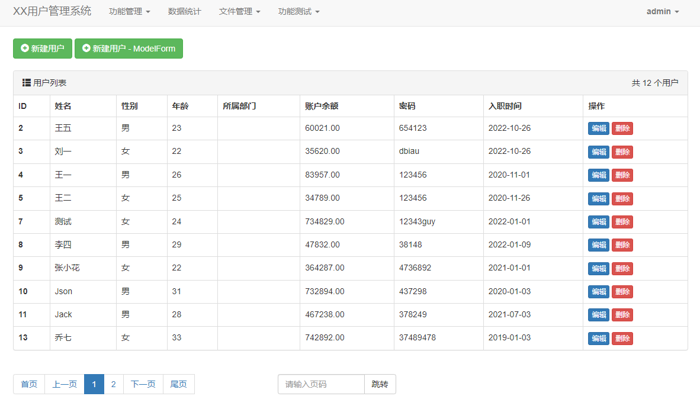
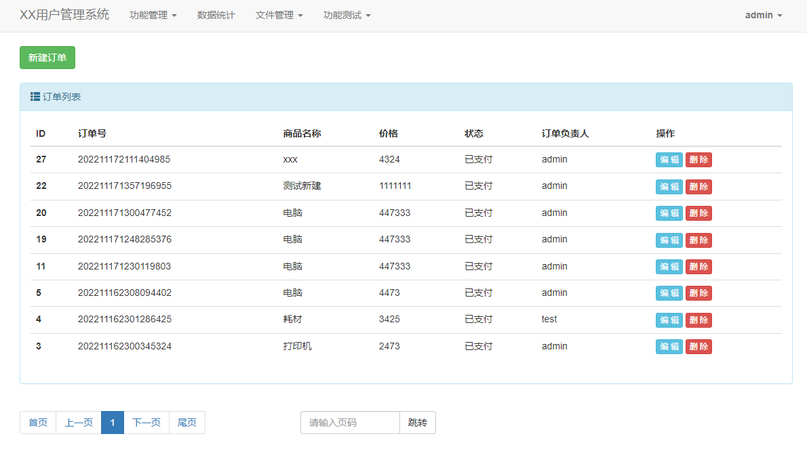
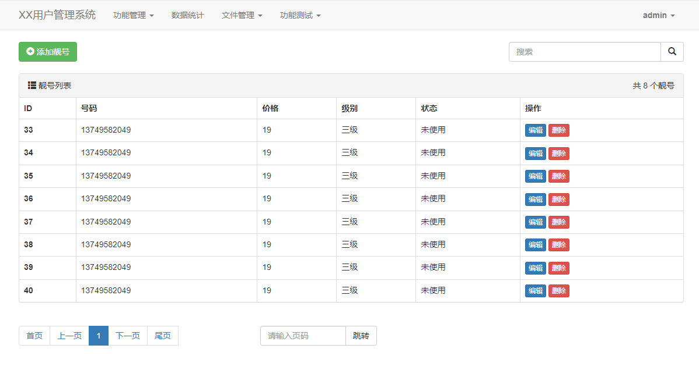
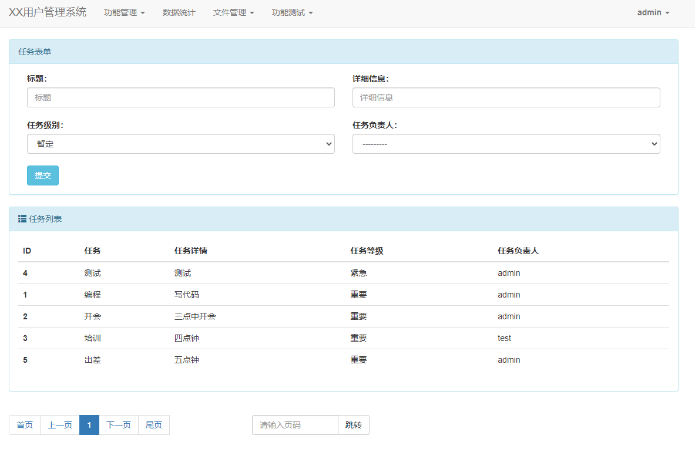
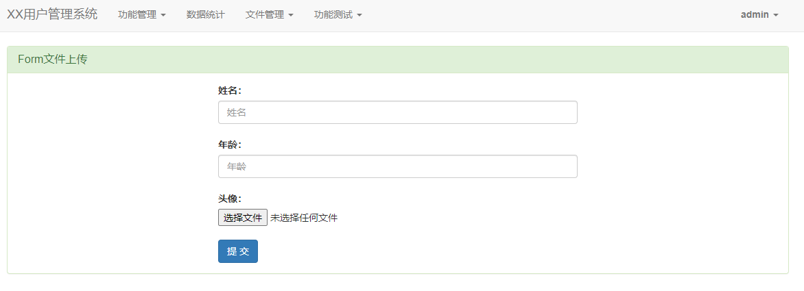
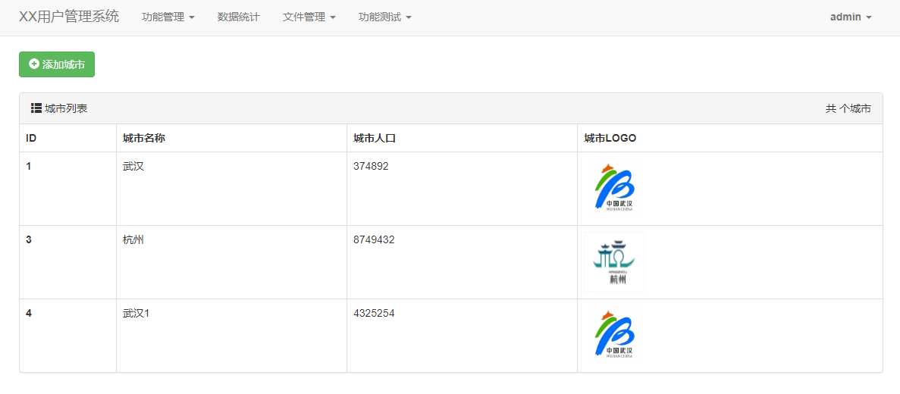
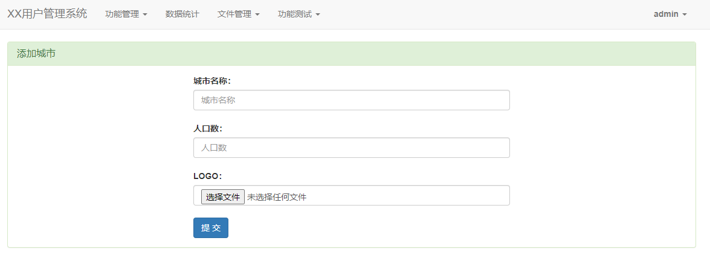

# XX管理系统
> - 项目基于Django，数据库使用MySQL
> - 初级练手项目
> - 对于有重复的代码没有进行优化，只实现相关功能

### 用户登录验证
- AUTH
- 验证码验证登录 

## 功能管理
### 1、管理员管理
- 添加、修改(密码重置)、删除、查询、分页

### 2、部门管理
- 部门添加
  - 使用`create()`实现对部门的
  - 通过上传含有部门数据的EXCEL表格来实现批量添加部门
- 使用`update()`实现对部门的修改
- 使用`delete()`实现对部门的删除
- 使用封装好的`Paginnation`分页组件对部门列表进行分页展示、跳转至指定页码

### 3、用户管理
- 分别使用`create()`、`ModelForm`实现对用户的添加
- 使用`ModelForm`实现对用户的修改、删除、查询
- 使用封装好的`Paginnation`分页组件对用户列表进行分页展示、跳转至指定页码

### 4、订单管理
- 分别使用`create()`、`ModelForm`实现对用户的添加
- 使用`ModelForm`实现对用户的修改、删除、查询
- 使用封装好的`Paginnation`分页组件对用户列表进行分页展示、跳转至指定页码

## 功能测试
### 1、手机靓号管理
- 使用`ModelForm`实现对手机靓号的添加、修改、删除、查询
- 使用封装好的`Paginnation`分页组件对手机靓号列表进行分页展示、跳转至指定页码
- 实现对手机靓号的搜索

### 2、任务管理
- 添加任务、任务列表、任务分页等

## 文件管理
- 分别使用`Form`和`ModelForm`实现对文件的上传

### `Form`文件上传

### `ModelForm`文件的上传及数据添加

